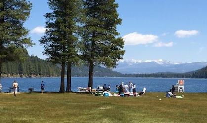
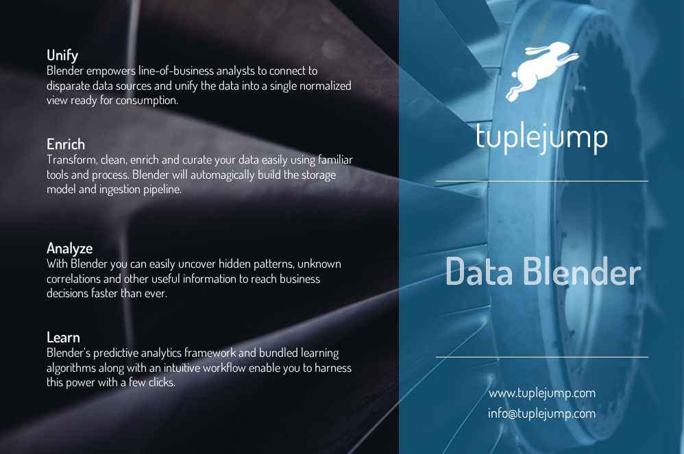
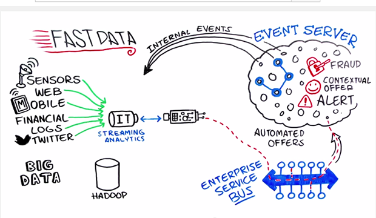
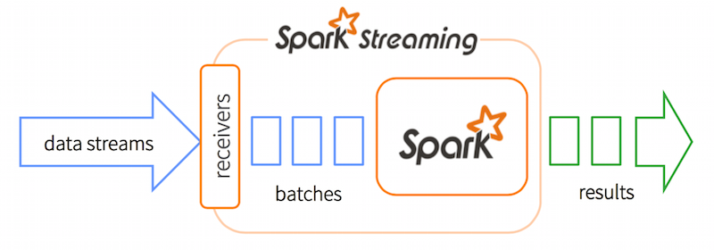
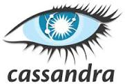
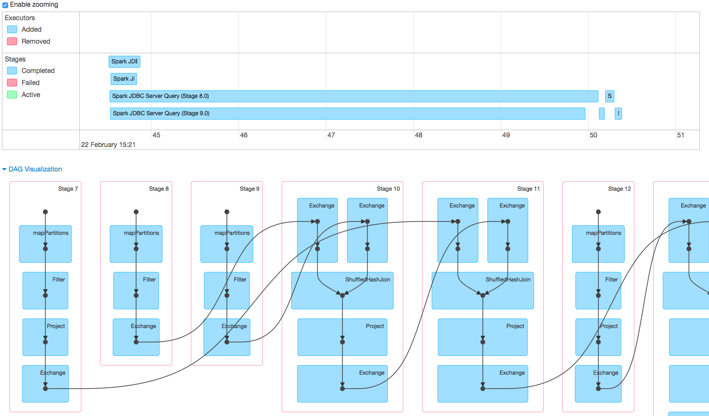

## Fast and Simplified Streaming, Ad-Hoc and 
## Batch Analytics with FiloDB and Spark Streaming

### [Evan Chan](https://twitter.com/Evanfchan) and [Helena Edelson](https://twitter.com/helenaedelson)
### March 2016

---

## Evan Chan

<center>

</center>

- Distinguished Engineer, [Tuplejump](http://www.tuplejump.com)
- [@evanfchan](https://twitter.com/Evanfchan)
- [`http://velvia.github.io`](http://velvia.github.io)
- User and contributor to Spark since 0.9, Cassandra since 0.6
- Co-creator and maintainer of [Spark Job Server](http://github.com/spark-jobserver/spark-jobserver)

---

## Helena Edelson

- VP of Product Engineering, [Tuplejump](http://www.tuplejump.com)
- Committer: Kafka Connect Cassandra, Spark Cassandra Connector
- Contributor to Akka (2 new features in Akka Cluster)
- Speaker @ Spark Summit, Kafka Summit, Strata, QCon, Scala Days, Scala World, Philly ETE 
- [@helenaedelson](https://twitter.com/helenaedelson)
- [`http://github.com/helena`](http://github.com/helena)

---

## Tuplejump

[Tuplejump](http://tuplejump.com) is a big data technology leader providing solutions and development partnership.

* [FiloDB](http://github.com/tuplejump/FiloDB) - subject of today's talk
* [Cassandra Kafka Connector](http://github.com/tuplejump/kafka-connector) - todo
* [Calliope](http://tuplejump.github.io/calliope/) - the first Spark-Cassandra integration
* [Stargate](http://tuplejump.github.io/stargate/) - an open source Lucene indexer for Cassandra
* [SnackFS](https://github.com/tuplejump/snackfs) - open source HDFS for Cassandra

---

**Tuplejump Blender** builds unified datasets for fast querying, from streaming and batch sources, 
with automated machine learning + analytics

 

---

## Tuplejump Consulting & Development


---

<center>

</center>

---

## Topics

* Modern streaming architectures and batch/ad-hoc architectures
* Precise and scalable streaming ingestion using Kafka, Akka, Spark Streaming, Cassandra, and FiloDB
* How a unified streaming + batch stack can lower your TCO
* What FiloDB is and how it enables fast analytics with competitive storage cost
* Data Warehousing with Spark, Cassandra, and FiloDB
* Time series / event data / geospatial examples
* Machine learning using Spark MLLib + Cassandra/FiloDB
* Integrating streaming and historical data analysis

---

### Big data is yesterday.
# FAST DATA
## is now.

---

<center>

</center>

---

## Fast Data

- Reactive processing of data as it comes in to derive instant insights.
- Is this enough?
- Usually need to combine with existing big data, historical processing, ad hoc.

---

## Let's Talk Architecture!

<center>
  
</center>

---

## Lambda Architecture...

<center>

</center>

(https://www.mapr.com/developercentral/lambda-architecture)

--

## Lambda is Hard

- Real-time pipeline backed by KV store for updates 
- Many moving parts - KV store, real time, batch
  + Lots of monitoring, operations, headache
- Running similar code in two places
- Still ingesting data to Parquet/HDFS 
- Reconcile queries against two different places

--

## NoLambda

<center>YES to:</center>

- A unified system 
- Real-time processing and reprocessing
- Code changes 
- Fault tolerance

---

## SMACK

- Scala/Spark Streaming
- Mesos
- Akka
- Cassandra
- Kafka

--

## Spark Streaming

<center>

</center>

"What's New In Spark Streaming" - Tathagada Das, Strata NY 2015

--

## <span class="cassred">Cassandra</span>

<center>

</center>

- Horizontally scalable
- Very flexible data modelling (lists, sets, custom data types)
- Easy to operate
- Perfect for ingestion of real time / machine data
- Best of breed storage technology, huge community
- **BUT: Simple queries only**
- **OLTP-oriented**

--

## Ad-Hoc and ML with Spark

DataFrames support in Spark Cassandra Connector:

<p>
```scala
val sqlContext = new org.apache.spark.sql.SQLContext(sc)

val df = sqlContext.read
                   .format("org.apache.spark.sql.cassandra")
                   .option("table", "gdelt")
                   .option("keyspace", "test").load()
df.registerTempTable("gdelt")
sqlContext.cacheTable("gdelt")
sqlContext.sql("SELECT count(monthyear) FROM gdelt").show()
```

--

## Spark provides the missing fast, deep analytics piece of <span class="cassred">Cassandra</span>!

### ...tying together fast event ingestion and rich deep analytics!

---

## What about Parquet?

- Good for static data
- Problem: Parquet is read-optimized, not easy to use for writes
    + Cannot support idempotent writes
    + Optimized for writing very large chunks, not small updates
    + Not suitable for time series, IoT, etc.
    + Often needs multiple passes of jobs for compaction of small files, deduplication, etc.

&nbsp;
<p>
People really want a database-like abstraction, not a file format!

---

## One Pipeline For Fast + Big Data


<!-- .element: class="mermaid" -->

--

## What are my storage needs?

- Non-persistent / in-memory: concurrent viewers
- Short term: latest trends
- Longer term: raw event and aggregate storage
- ML Models, predictions, scored data

--

## Spark RDDs

- Immutable, cache in memory and/or on disk
- Spark Streaming: UpdateStateByKey
- IndexedRDD - can update bits of data
- Snapshotting for recovery

--

## Using Cassandra for Short Term Storage

|          | 1020s | 1010s | 1000s |
| -------- | ----- | ----- | ----- |
| Bus A    | Speed, GPS |   |      |
| Bus B    |       |        |      |
| Bus C    |       |        |      |

- Primary key = (Bus UUID, timestamp)
- Easy queries: location and speed of single bus for a range of time
- Can also query most recent location + speed of all buses (slower)

--

## Using Cassandra for Longer-Term Event Storage / ML?

- Storage efficiency and scan speeds for reading large volumes of data (for complex analytics, ML) become important concerns
- Regular Cassandra CQL tables are not very good at either storage efficiency or scan speeds
- Have to be a bit creative with how you store data in Cassandra  :)

---

> All hard work leads to profit, but mere talk leads to poverty.<br>
> - Proverbs 14:23

---

## Introducing <span class="golden">FiloDB</span>

<center>
A distributed, versioned, columnar analytics database. Built for Streaming.
</center>

<p>&nbsp;<p>
<center>
[github.com/tuplejump/FiloDB](http://github.com/tuplejump/FiloDB)
</center>

--

## Fast Analytics Storage

- Scan speeds competitive with Apache Parquet
  + Up to 200x faster scan speeds than with Cassandra 2.x
- Flexible filtering along two dimensions
  + Much more efficient and flexible partition key filtering
- Efficient columnar storage, up to 27x more efficient than Cassandra 2.x

NOTE: 200x is just based on columnar storage + projection pushdown - no filtering on sort or partition keys, and no caching done yet.

--

## Comparing Storage Costs and Query Speeds

<center>

</center>

[https://www.oreilly.com/ideas/apache-cassandra-for-analytics-a-performance-and-storage-analysis](https://www.oreilly.com/ideas/apache-cassandra-for-analytics-a-performance-and-storage-analysis)

--

## Robust Distributed Storage

Apache Cassandra as the rock-solid storage engine.  Scale out with no SPOF.  Cross-datacenter replication.
Proven storage and database technology.

--

## Cassandra-Like Data Model

<table>
  <tr>
    <td></td>
    <td colspan="2">Column A</td>
    <td colspan="2">Column B</td>
  </tr>
  <tr>
    <td>Partition key 1</td>
    <td>Segment 1</td>
    <td>Segment 2</td>
    <td>Segment 1</td>
    <td>Segment 2</td>
  </tr>
  <tr>
    <td>Partition key 2</td>
    <td>Segment 1</td>
    <td>Segment 2</td>
    <td>Segment 1</td>
    <td>Segment 2</td>
  </tr>
</table>
&nbsp;<p>

- **partition keys** - distributes data around a cluster, and allows for fine grained and flexible filtering
- **segment keys** - do range scans within a partition, eg by time slice
- primary key based ingestion and updates

--

## Flexible Filtering

Unlike Cassandra, FiloDB offers very flexible and efficient filtering on partition keys.  Partial key matches, fast IN queries on any part of the partition key.  There is no need to write multiple tables to work around answering different queries.

--

## Spark SQL Queries!

```sql
CREATE TABLE gdelt USING filodb.spark OPTIONS (dataset "gdelt");

SELECT Actor1Name, Actor2Name, AvgTone FROM gdelt ORDER BY AvgTone DESC LIMIT 15;

INSERT INTO gdelt SELECT * FROM NewMonthData;
```

- Read to and write from Spark Dataframes
- Append/merge to FiloDB table from Spark Streaming
- Use Tableau or any other JDBC tool

--

## What's in the name?

<center>

</center>

Rich sweet layers of distributed, versioned database goodness

--

## SMACK stack for all your Analytics


<!-- .element: class="mermaid" -->

- Regular Cassandra tables for highly concurrent, aggregate / key-value lookups (dashboards)
- FiloDB + C* + Spark for efficient long term event storage
  - Ad hoc / SQL / BI
  - Data source for MLLib / building models
  - Data storage for classified / predicted / scored data

---

## Data Warehousing with <span class="golden">FiloDB</span>

--

## Scenarios

- BI Reporting, concurrency + seconds latency
- Ad-hoc queries
- Needing to do JOINs with fact tables + dimension tables
  + Slowly changing dim tables / hard to denormalize
- Need to work with legacy BI tools

--

## Data Warehousing / BI with
## FiloDB + C + Spark


<!-- .element: class="mermaid" -->

Efficient columnar storage + filtering = low latency BI

--

## Modeling Fact Tables for FiloDB

- Single partition queries are really fast and take up only one thread
  + `entity_number = '0453' AND year_month = '2014 December'`
- Multi partition queries still MUCH faster than full table scans
  + FiloDB first scans a smaller table, so it can take arbitrary partition filters
  + Partial filters like `entity_number IN (a, b, c)` perfectly acceptable

--

## Multi-Table JOINs with just Cassandra

<center>

</center>

--

## Sub-second Multi-Table JOINs with FiloDB

<center>

</center>

--

## Sub-second Multi-Table JOINs with FiloDB

- Four tables, all of them single-partition queries
- Two tables were switched from regular Cassandra tables to FiloDB tables.  40-60 columns each, ~60k items in partition.
- Scan times for those tables went down from 5-6 seconds to < 250ms

For more details, please see blog post: XXXX

---

## Scalable Time-Series / Event Storage with <span class="golden">FiloDB</span>

--

## Designed for Streaming

- New rows appended via Spark Streaming or Kafka
- Writes are *idempotent* - easy **exactly once** ingestion
- Converted to columnar chunks on ingest and stored in C*
- FiloDB keeps your data sorted as it is being ingested

--

## Modeling Time Series with FiloDB

| Entity  | Time1 | Time2 |
| ------- | ----- | ----- |
| US-0123 | d1    | d2    |
| NZ-9495 | d1    | d2    |

&nbsp;<p>
Model your time series with FiloDB similarly to Cassandra:

- **Segment key**: `:timeslice timestamp 4h`
- **Partition Keys**:
  - Event/machine UUID (smaller # of events)
  - Event/machine UUID hash + time period
* **Row Keys**: Timestamp, machine UUID

FiloDB keeps data sorted while stored in efficient columnar storage.

--

## Spark Streaming -> FiloDB

```scala
    val ratingsStream = KafkaUtils.createDirectStream[String, String, StringDecoder, StringDecoder](ssc, kafkaParams, topics)
    ratingsStream.foreachRDD {
      (message: RDD[(String, String)], batchTime: Time) => {
        val df = message.map(_._2.split(",")).map(rating => Rating(rating(0).trim.toInt, rating(1).trim.toInt, rating(2).trim.toInt)).
          toDF("fromuserid", "touserid", "rating")
      
        // add the batch time to the DataFrame
        val dfWithBatchTime = df.withColumn("batch_time", org.apache.spark.sql.functions.lit(batchTime.milliseconds))
      
        // save the DataFrame to FiloDB
        dfWithBatchTime.write.format("filodb.spark")
          .option("dataset", "ratings")
          .save()
      }
    }
```
One-line change to write to FiloDB vs Cassandra

--

# DEMO TIME

### New York City Taxi Data Demo (Spark Notebook)

---

## Fast, Updatable In-Memory
## Columnar Storage


<!-- .element: class="mermaid" -->

- Unlike RDDs and DataFrames, FiloDB can ingest new data, and still be fast
- Unlike RDDs, FiloDB can filter in multiple ways, no need for entire table scan
- FAIR scheduler + sub-second latencies => web speed queries

--

## 700 Queries Per Second in Apache Spark!

- Even for datasets with 15 million rows!
- Using FiloDB's `InMemoryColumnStore`, single host / MBP, 5GB RAM
- SQL to DataFrame caching

For more details, see [this blog post](http://velvia.github.io/Spark-Concurrent-Fast-Queries/).

---

## Machine Learning with Spark, Cassandra, and FiloDB

---

## Integrating Historical and Streaming Workloads

---

## <span class="golden">FiloDB</span> - How?

--

## Multiple ways to Accelerate Queries

* Columnar projection - read fewer columns, saves I/O
* Partition key filtering - read less data
* Sort key / PK filtering - read from subset of keys
  - Possible because FiloDB keeps data sorted
* Versioning - write to multiple versions, read from the one you choose

--

## Cassandra CQL vs Columnar Layout

Cassandra stores CQL tables row-major, each row spans multiple cells:

| PartitionKey | 01:first | 01:last | 01:age | 02:first | 02:last | 02:age |
| :----------- | :------- | :------ | -----: | :------- | :------ | -----: |
| Sales        | Bob      | Jones   | 34     | Susan    | O'Connor | 40    |
| Engineering  | Dilbert  | P       | ?      | Dogbert  | Dog     |  1     |

&nbsp;<p>
Columnar layouts are column-major:

| PartitionKey | first  |  last  |  age  |
| :----------- | ------ | ------ | ----- |
| Sales        | Bob, Susan | Jones, O'Connor | 34, 40 |
| Engineering  | Dilbert, Dogbert | P, Dog    | ?, 1   |

--

## FiloDB Cassandra Schema

```sql
CREATE TABLE filodb.gdelt_chunks (
    partition text,
    version int,
    columnname text,
    segmentid blob,
    chunkid int,
    data blob,
    PRIMARY KEY ((partition, version), columnname, segmentid, chunkid)
) WITH CLUSTERING ORDER BY (columnname ASC, segmentid ASC, chunkid ASC)
```

--

## FiloDB Architecture

<center>

</center>

ColumnStore API - currently Cassandra and InMemory, you can implement other backends - ElasticSearch?  etc.

---

## FiloDB - Roadmap

* Support for many more data types and sort and partition keys - please give us your input!
* Non-Spark ingestion API.  Your input is again needed.
* In-memory caching for significant query speedup
* Projections.  Often-repeated queries can be sped up significantly with projections.
* Use of GPU and SIMD instructions to speed up queries

--

## You can help!

- Send me your use cases for fast big data analysis on Spark and Cassandra
    + Especially IoT, Event, Time-Series
    + What is your data model?
- Email if you want to contribute

---
 
## Thanks For Attending!
 
- [@helenaedelson](https://twitter.com/helenaedelson)
- [@evanfchan](https://twitter.com/Evanfchan)
- [@tuplejump](https://twitter.com/tuplejump) 
---

# THANK YOU! 
