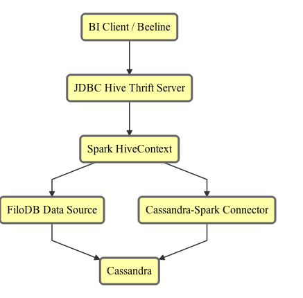
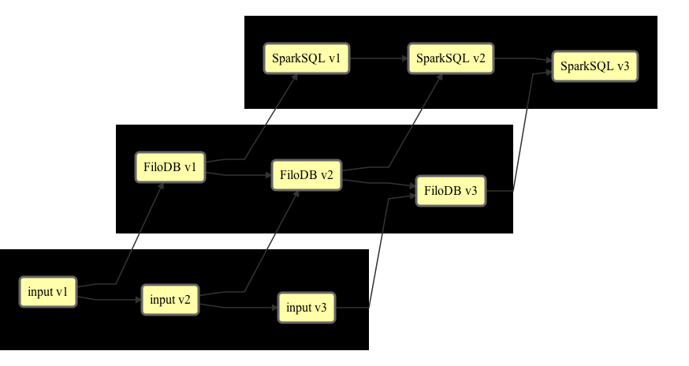
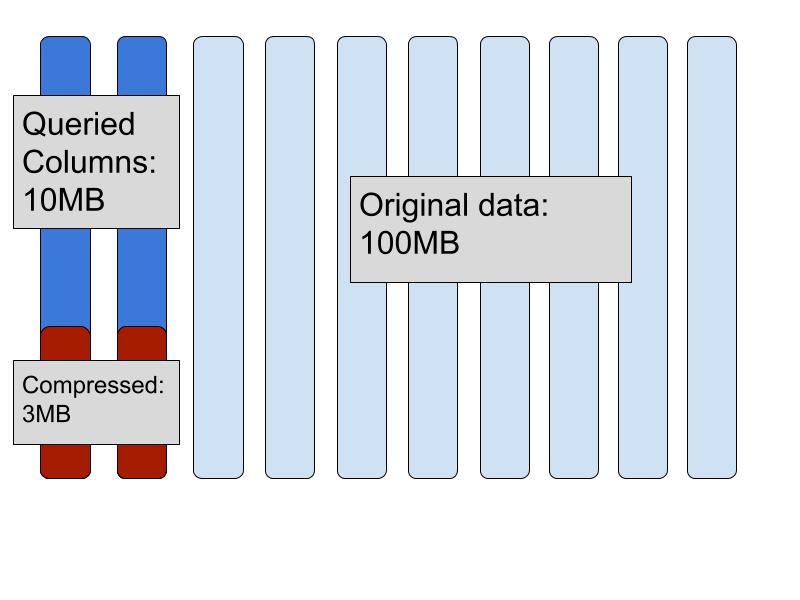

## Fast and Simplified Streaming, Ad-Hoc and 
## Batch Analytics with FiloDB and Spark Streaming

### [Evan Chan](https://twitter.com/Evanfchan) and [Helena Edelson](https://twitter.com/helenaedelson)
### March 2016

---

## Evan Chan

<center>

</center>

- Distinguished Engineer, [Tuplejump](http://www.tuplejump.com)
- @evanfchan [@evanfchan](https://twitter.com/Evanfchan)
- [`http://velvia.github.io`](http://velvia.github.io)
- User and contributor to Spark since 0.9, Cassandra since 0.6
- Co-creator and maintainer of [Spark Job Server](http://github.com/spark-jobserver/spark-jobserver)

---

## Helena Edelson

- VP of Product Engineering, [Tuplejump](http://www.tuplejump.com)
- Committer: Kafka Connect Cassandra, Spark Cassandra Connector
- Contributor to Akka (2 new features in Akka Cluster)
- Speaker @ Spark Summit, Kafka Summit, Strata, QCon, Scala Days, Scala World, Philly ETE 
- [@helenaedelson](https://twitter.com/helenaedelson)
- [`http://github.com/helena`](http://github.com/helena)

---

## Tuplejump

[Tuplejump](http://tuplejump.com) is a big data technology leader providing solutions and development partnership.

* [FiloDB](http://github.com/tuplejump/FiloDB) - subject of today's talk
* [Cassandra Kafka Connector](http://github.com/tuplejump/kafka-connector) - todo
* [Calliope](http://tuplejump.github.io/calliope/) - the first Spark-Cassandra integration
* [Stargate](http://tuplejump.github.io/stargate/) - an open source Lucene indexer for Cassandra
* [SnackFS](https://github.com/tuplejump/snackfs) - open source HDFS for Cassandra

---

**Tuplejump Blender** builds unified datasets for fast querying, from streaming and batch sources, 
with automated machine learning + analytics

 

---

## Tuplejump Consulting & Development


---

<center>

</center>

---

## Topics

* Modern streaming architectures and batch/ad-hoc architectures
* Integrating streaming and historical data analysis
* How a unified streaming + batch stack can lower your TCO
* What FiloDB is and how it enables fast analytics with competitive storage cost
* Use cases involving IoT, time series, machine, event data
* Use case involving geospatial and smart cities data
* Simplifying streaming and batch with Scala, Spark, Akka, Cassandra, Kafka and FiloDB

---

### Big data is yesterday.
# FAST DATA
## is now.

---

<center>

</center>

---

## Fast Data

- Reactive processing of data as it comes in to derive instant insights.
- Is this enough?
- Usually need to combine with existing big data, historical processing, ad hoc.

---

## Let's Talk Architecture!

<center>
  
</center>

---

## Lambda Architecture...

<center>

</center>

(https://www.mapr.com/developercentral/lambda-architecture)

--

## Lambda is Hard

- Real-time pipeline backed by KV store for updates 
- Many moving parts - KV store, real time, batch
  + Lots of monitoring, operations, headache
- Running similar code in two places
- Still ingesting data to Parquet/HDFS 
- Reconcile queries against two different places

--

## NoLambda

<center>YES to:</center>

- A unified system 
- Real-time processing and reprocessing
- Code changes 
- Fault tolerance

---

## SMACK

- Scala/Spark Streaming
- Mesos
- Akka
- Cassandra
- Kafka

--

## Spark Streaming

<center>

</center>

"What's New In Spark Streaming" - Tathagada Das, Strata NY 2015

--

## <span class="cassred">Cassandra</span>

<center>

</center>

- Horizontally scalable
- Very flexible data modelling (lists, sets, custom data types)
- Easy to operate
- Perfect for ingestion of real time / machine data
- Best of breed storage technology, huge community
- **BUT: Simple queries only**
- **OLTP-oriented**

--

## Ad-Hoc and ML with Spark

DataFrames support in Spark Cassandra Connector:

<p>
```scala
val sqlContext = new org.apache.spark.sql.SQLContext(sc)

val df = sqlContext.read
                   .format("org.apache.spark.sql.cassandra")
                   .option("table", "gdelt")
                   .option("keyspace", "test").load()
df.registerTempTable("gdelt")
sqlContext.cacheTable("gdelt")
sqlContext.sql("SELECT count(monthyear) FROM gdelt").show()
```

--

## Spark provides the missing fast, deep analytics piece of <span class="cassred">Cassandra</span>!

### ...tying together fast event ingestion and rich deep analytics!

--

## So What Are We Missing?

| We got    | We're missing   |
|-----------|-----------------|
| Stream processing |         |
| KV storage        |  ??     |
| Analysis (Spark)  |         |

--

## So What Are We Missing?

| We got    | We're missing   |
|-----------|-----------------|
| Stream processing | *Reasonably* fast ad-hoc   |
| KV storage        | ML and advanced analytics  |
| Analysis (Spark)  |     |

&nbsp;<p>
Ad hoc analysis of Cassandra data is VERY slow.  100-300x slower than Parquet.

---

## What about Parquet?

- Good for static data
- Problem: Parquet is read-optimized, not easy to use for writes
    + Cannot support idempotent writes
    + Optimized for writing very large chunks, not small updates
    + Not suitable for time series, IoT, etc.
    + Often needs multiple passes of jobs for compaction of small files, deduplication, etc.

&nbsp;
<p>
People really want a database-like abstraction, not a file format!

---

## One Pipeline For Fast + Big Data


<!-- .element: class="mermaid" -->

Now, how do I make the SMACK stack work for ML, Ad-Hoc + Fast Data?

How do I combine Spark Streaming + Ad Hoc and have good performance?

---

> All hard work leads to profit, but mere talk leads to poverty.<br>
> - Proverbs 14:23

---

## Introducing <span class="golden">FiloDB</span>

<center>
A distributed, versioned, columnar analytics database. Built for Streaming.
</center>

<p>&nbsp;<p>
<center>
[github.com/tuplejump/FiloDB](http://github.com/tuplejump/FiloDB)
</center>

---

## <span class="golden">FiloDB</span> - What?

--

## Fast Analytics Storage

- Scan speeds competitive with Apache Parquet
  + Up to 200x faster scan speeds than with Cassandra 2.x
- Flexible filtering along two dimensions
  + Much more efficient and flexible partition key filtering
- Efficient columnar storage, up to 27x more efficient than Cassandra 2.x

NOTE: 200x is just based on columnar storage + projection pushdown - no filtering on sort or partition keys, and no caching done yet.

--

## <span class="golden">FiloDB</span> = Streaming + Columnar

### Fast Streaming Data + Big Data, All in One!

NOTE: Combining streaming input and columnar/analytical storage is an extremely hard problem, that we are solving!

--

## Robust Distributed Storage

Apache Cassandra as the rock-solid storage engine.  Scale out with no SPOF.  Cross-datacenter replication.
Proven storage and database technology.

--

## Familiar, Flexible Data Model

Just like Apache Cassandra, FiloDB allows you to organize your data using

- **partition keys** - distributes data around a cluster, and allows for fine grained and flexible filtering
- **segment keys** - do range scans within a partition, eg by time slice
- primary key based ingestion and updates

Unlike Cassandra, FiloDB offers very flexible and efficient filtering on partition keys.  There is no need to write multiple tables to work around answering different queries.

--

## Spark SQL Queries!

```sql
CREATE TEMPORARY TABLE gdelt
USING filodb.spark
OPTIONS (dataset "gdelt");

SELECT Actor1Name, Actor2Name, AvgTone FROM gdelt ORDER BY AvgTone DESC LIMIT 15;
```

- Read to and write from Spark Dataframes
- Append/merge to FiloDB table from Spark Streaming
- Use Tableau or any other JDBC tool

--

## What's in the name?

<center>

</center>

Rich sweet layers of distributed, versioned database goodness

--

## 100% Reactive

Built completely on the Typesafe Platform:

- Scala 2.10 and SBT
- Spark (including custom data source)
- Akka Actors for rational scale-out concurrency
- Futures for I/O
- Phantom Cassandra client for reactive, type-safe C* I/O
- Typesafe Config

---

## <span class="golden">FiloDB</span> - Why?

--

## Data Warehousing / BI on
## Spark and Cassandra


<!-- .element: class="mermaid" -->

Efficient columnar storage + filtering = low latency BI

--

## Designed for Streaming

- New rows appended via Spark Streaming or Kafka
- Writes are *idempotent* - easy **exactly once** ingestion
- Converted to columnar chunks on ingest and stored in C*
- FiloDB keeps your data sorted as it is being ingested

--

## Fast Event/Time-Series Ad-Hoc Analytics

| Entity  | Time1 | Time2 |
| ------- | ----- | ----- |
| US-0123 | d1    | d2    |
| NZ-9495 | d1    | d2    |

&nbsp;<p>
Model your time series with FiloDB similarly to Cassandra:

- **Segment key**: Timestamp, similar to clustering key
- **Partition Keys**: Event/machine entity, maybe week/month etc.

FiloDB keeps data sorted while stored in efficient columnar storage.

--

## Fast, Updatable In-Memory
## Columnar Storage


<!-- .element: class="mermaid" -->

- Unlike RDDs and DataFrames, FiloDB can ingest new data, and still be fast
- Unlike RDDs, FiloDB can filter in multiple ways, no need for entire table scan
- FAIR scheduler + sub-second latencies => web speed queries

--

## SMACK stack for all your Analytics


<!-- .element: class="mermaid" -->

- Write key-value lookups to Cassandra regularly
- Write raw data / events to FiloDB for ad-hoc analysis / ML
- Far smaller stack to maintain for your analytics

---

## Spark Streaming -> FiloDB

```scala
    val ratingsStream = KafkaUtils.createDirectStream[String, String, StringDecoder, StringDecoder](ssc, kafkaParams, topics)
    ratingsStream.foreachRDD {
      (message: RDD[(String, String)], batchTime: Time) => {
        val df = message.map(_._2.split(",")).map(rating => Rating(rating(0).trim.toInt, rating(1).trim.toInt, rating(2).trim.toInt)).
          toDF("fromuserid", "touserid", "rating")
      
        // add the batch time to the DataFrame
        val dfWithBatchTime = df.withColumn("batch_time", org.apache.spark.sql.functions.lit(batchTime.milliseconds))
      
        // save the DataFrame to FiloDB
        dfWithBatchTime.write.format("filodb.spark")
          .option("dataset", "ratings")
          .save()
      }
    }
```
One-line change to write to FiloDB vs Cassandra

---

## Versioning - why it matters

- Databases: let's mutate one giant piece of state in place
    + **Basically hasn't changed since 1970's!**
- With Big Data and streaming, incremental processing is more and more important
- FiloDB is built on functional principles and lets you version and layer changes.  Add changes as new versions, don't mutate!
- Keep reading from older versions as changes are done to new versions

NOTE: Databases have largely remained the same - even more modern, in-memory ones.They are basically one monolithic piece of state.

---

## Versioning enables Streaming


<!-- .element: class="mermaid" -->

---

## <span class="golden">FiloDB</span> - How?

--

## Multiple ways to Accelerate Queries

* Columnar projection - read fewer columns, saves I/O
* Partition key filtering - read less data
* Sort key / PK filtering - read from subset of keys
  - Possible because FiloDB keeps data sorted
* Versioning - write to multiple versions, read from the one you choose

--

## Cassandra CQL vs Columnar Layout

Cassandra stores CQL tables row-major, each row spans multiple cells:

| PartitionKey | 01:first | 01:last | 01:age | 02:first | 02:last | 02:age |
| :----------- | :------- | :------ | -----: | :------- | :------ | -----: |
| Sales        | Bob      | Jones   | 34     | Susan    | O'Connor | 40    |
| Engineering  | Dilbert  | P       | ?      | Dogbert  | Dog     |  1     |

&nbsp;<p>
Columnar layouts are column-major:

| PartitionKey | first  |  last  |  age  |
| :----------- | ------ | ------ | ----- |
| Sales        | Bob, Susan | Jones, O'Connor | 34, 40 |
| Engineering  | Dilbert, Dogbert | P, Dog    | ?, 1   |

--

## Columnar Format solves I/O

How much data can I query interactively?  More than you think!

<center>

</center>

--

## Columnar Storage Performance Study

<center>
http://github.com/velvia/cassandra-gdelt
</center>
&nbsp;

| Scenario       | Ingest   | Read all columns | Read one column |
| :------------- | -------: | ---------------: | --------------: |
| Narrow table   | 1927 sec | 505 sec          | 504 sec         |
| Wide table     | 3897 sec | 365 sec          | 351 sec         |
| Columnar       |  93 sec  |   8.6 sec        | 0.23 sec        |

&nbsp;<p>
On reads, using a columnar format is up to **2190x** faster, while ingestion is 20-40x faster.

--

## FiloDB Cassandra Schema

```sql
CREATE TABLE filodb.gdelt_chunks (
    partition text,
    version int,
    columnname text,
    segmentid blob,
    chunkid int,
    data blob,
    PRIMARY KEY ((partition, version), columnname, segmentid, chunkid)
) WITH CLUSTERING ORDER BY (columnname ASC, segmentid ASC, chunkid ASC)
```

--

## Columnar Format solves Caching

- Use the same format on disk, in cache, in memory scan
    + Caching works a lot better when the cached object is the same!!
- No data format dissonance means bringing in new bits of data and combining with existing cached data is seamless

--

## FiloDB Architecture

<center>

</center>

ColumnStore API - currently Cassandra and InMemory, you can implement other backends - ElasticSearch?  etc.

--

## Ingestion and Storage?

Current version:

* Each dataset is stored using 2 regular Cassandra tables
* Ingestion using Spark (Dataframes or SQL)

Future version?

* Automatic ingestion of your existing C* data using custom secondary index

---

## Towards Extreme Query Performance

--

## The filo project

[http://github.com/velvia/filo](http://github.com/velvia/filo) is a binary data vector library designed for extreme read performance with minimal deserialization costs.

- Designed for NoSQL, not a file format
- random or linear access
- on or off heap
- missing value support
- Scala only, but cross-platform support possible

--

## What is the ceiling?

This Scala loop can read integers from a binary Filo blob at a rate of **2 billion integers** per second - single threaded:

```scala
  def sumAllInts(): Int = {
    var total = 0
    for { i <- 0 until numValues optimized } {
      total += sc(i)
    }
    total
  }
```

--

## Vectorization of Spark Queries

The [Tungsten](https://databricks.com/blog/2015/04/28/project-tungsten-bringing-spark-closer-to-bare-metal.html) project.

Process many elements from the same column at once, keep data in L1/L2 cache.

Coming in Spark 1.4 through 1.6

--

## Hot Column Caching in Tachyon

- Has a "table" feature, originally designed for Shark
- Keep hot columnar chunks in shared off-heap memory for fast access

---

## FiloDB - Roadmap

* Support for many more data types and sort and partition keys - please give us your input!
* Non-Spark ingestion API.  Your input is again needed.
* In-memory caching for significant query speedup
* Projections.  Often-repeated queries can be sped up significantly with projections.
* Use of GPU and SIMD instructions to speed up queries

--

## You can help!

- Send me your use cases for fast big data analysis on Spark and Cassandra
    + Especially IoT, Event, Time-Series
    + What is your data model?
- Email if you want to contribute

---

## Thanks For Attending!

<center>
to the entire OSS community, but in particular:
</center>
 
- Rohit Rai and Satya B., Tuplejump
- My colleagues at Socrata

<p>&nbsp;</p>
> If you want to go fast, go alone.  If you want to go far, go together.<br>
  -- African proverb

---

# DEMO TIME

### GDELT: Regular C* Tables vs FiloDB

---

## FiloDB vs Parquet

* Comparable read performance - with lots of space to improve
  - Assuming co-located Spark and Cassandra
  - Competitive performance for different queries incld joins
  - FiloDB has more room to grow - due to hot column caching and much less deserialization overhead, plus much more filtering flexibility
* Lower memory requirement due to much smaller block sizes
* Much better fit for IoT / Machine / Time-series applications
  - Idempotent writes by PK with no deduplication
* Limited support for types
  - array / set / map support not there, but will be added


